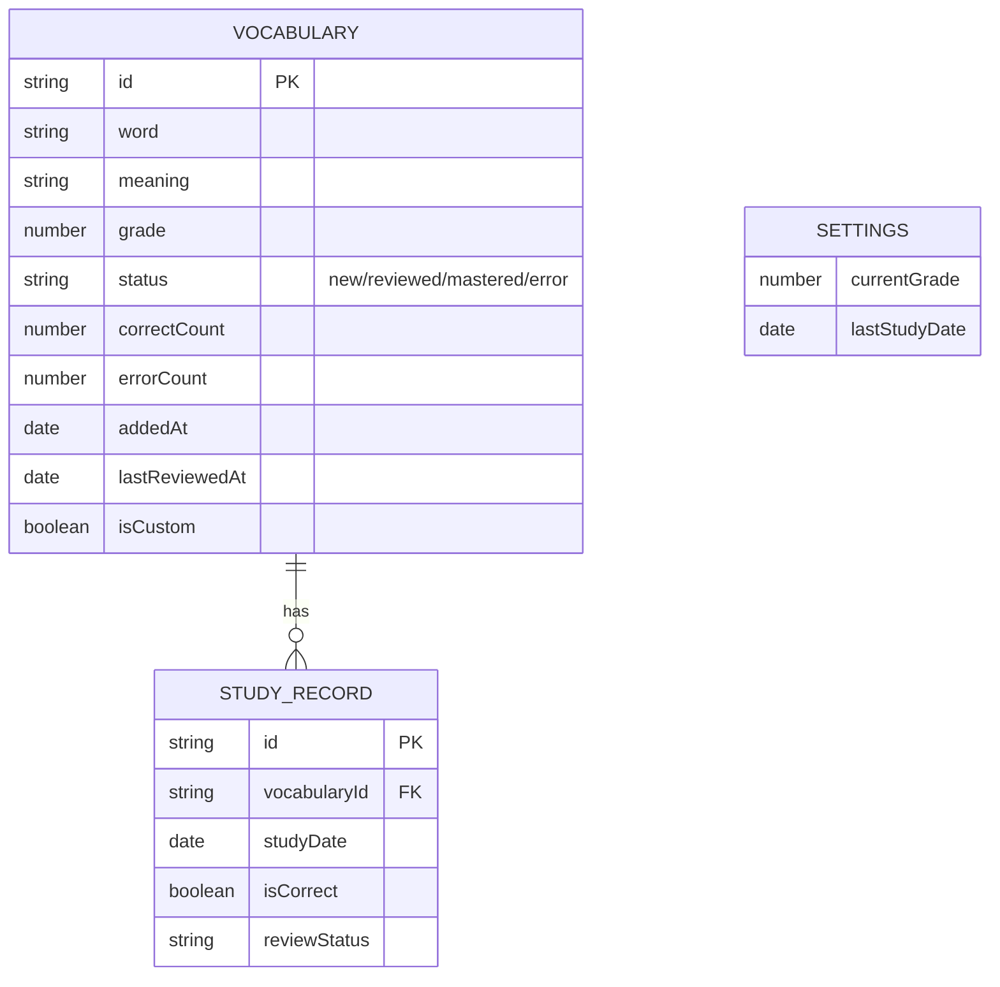

# 小学英语单词默写工具 - 技术架构文档

## 1. Architecture Design

```mermaid
graph TB
    subgraph "Frontend (React)"
        A[Pages] --> B[Components]
        B --> C[Hooks]
        C --> D[State Management (Zustand)]
        D --> E[LocalStorage]
    end
    
    subgraph "External Services"
        F[PDF Generation]
    end
    
    subgraph "Data Storage"
        G[LocalStorage - Vocabulary]
        H[LocalStorage - StudyRecords]
        I[LocalStorage - Settings]
    end
    
    A --&gt; F
    D --&gt; G
    D --&gt; H
    D --&gt; I
```

## 2. Technology Description

- **Frontend**: React@18 + TypeScript + tailwindcss@3 + vite
- **Initialization Tool**: vite-init
- **Backend**: None (纯前端应用，使用 LocalStorage 存储数据)
- **Database**: LocalStorage
- **PDF Generation**: html2canvas + jspdf

## 3. Route Definitions

| Route | Purpose |
|-------|---------|
| / | 主页 - 年级选择、今日任务概览 |
| /daily | 每日默写 - 今日任务、试卷生成、结果标记 |
| /vocabulary | 词汇管理 - 词汇库、词汇录入、词汇编辑 |
| /papers | 试卷中心 - 试卷类型选择、试卷配置、试卷预览 |
| /statistics | 数据统计 - 学习进度、词汇状态分析 |

## 4. API Definitions

本项目为纯前端应用，无后端 API，所有数据通过 LocalStorage 进行存储和访问。

## 5. Server Architecture Diagram

本项目不涉及后端服务。

## 6. Data Model

### 6.1 Data Model Definition



### 6.2 Data Definition Language

```typescript
// Vocabulary 类型定义
interface Vocabulary {
  id: string;
  word: string;
  meaning: string;
  grade: number; // 2-6
  status: 'new' | 'reviewed' | 'mastered' | 'error';
  correctCount: number;
  errorCount: number;
  addedAt: string;
  lastReviewedAt?: string;
  isCustom: boolean;
}

// StudyRecord 类型定义
interface StudyRecord {
  id: string;
  vocabularyId: string;
  studyDate: string;
  isCorrect: boolean;
  reviewStatus: string;
}

// Settings 类型定义
interface Settings {
  currentGrade: number;
  lastStudyDate: string;
}

// DailyTask 类型定义
interface DailyTask {
  date: string;
  grade: number;
  newWords: Vocabulary[];
  reviewedWords: Vocabulary[];
  completed: boolean;
}

// GradeConfig 类型定义
interface GradeConfig {
  total: number;
  newCount: number;
  reviewCount: number;
}

// PaperType 类型定义
type PaperType = 'daily' | 'error' | 'custom';
```

### 6.3 数据存储方案

使用 LocalStorage 存储以下数据：

1. `vocabulary` - 词汇库数组
2. `studyRecords` - 学习记录数组
3. `settings` - 用户设置对象
4. `dailyTasks` - 每日任务记录
5. `initialVocabularyLoaded` - 初始词汇加载标记

### 6.4 初始数据集

内置各年级标准词汇库，将在应用首次启动时初始化。包括：
- 二年级基础词汇
- 三年级基础词汇
- 四年级基础词汇
- 五年级基础词汇
- 六年级基础词汇

每个词汇包含：英文单词、中文释义、年级、初始状态等信息。
