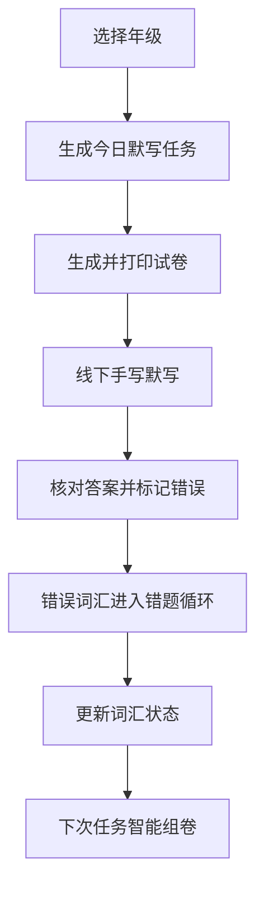

# 小学英语单词默写工具 - 产品需求文档

## 1. Product Overview
小学英语单词默写工具是一款面向小学生的分年级英语单词纸质默写产品，依托科学记忆算法，自动配比每日新词、旧词默写内容，支持自定义词汇录入、错题智能循环复习、标准化默写试卷导出打印。

- **主要用途**：帮助小学生通过线下纸质默写方式高效掌握英语单词
- **目标用户**：小学生（二至六年级）、家长、教师
- **解决问题**：替代传统随机组卷，通过科学记忆规律和智能组卷提高学习效率
- **市场价值**：填补小学生英语单词智能默写工具的市场空白

## 2. Core Features

### 2.1 User Roles
| Role | Registration Method | Core Permissions |
|------|---------------------|------------------|
| Normal User | 本地数据存储 | 全部功能使用权限 |

### 2.2 Feature Module
1. **主页**：年级选择、今日任务概览、快速操作入口
2. **每日默写**：今日任务展示、试卷生成、默写结果标记
3. **词汇管理**：词汇库浏览、自定义词汇录入、词汇状态管理
4. **试卷中心**：多类型试卷生成（常规卷、错题卷、自定义卷）、导出打印
5. **数据统计**：学习进度统计、词汇掌握情况分析

### 2.3 Page Details
| Page Name | Module Name | Feature description |
|-----------|-------------|---------------------|
| 主页 | 年级选择 | 支持选择二至六年级，自动切换年级词汇库 |
| 主页 | 今日任务概览 | 展示今日需默写的新词、旧词数量，一键生成试卷 |
| 每日默写 | 任务详情 | 展示今日词汇列表，可查看词汇详情 |
| 每日默写 | 试卷生成 | 一键生成标准化默写试卷，支持PDF导出和打印 |
| 每日默写 | 结果标记 | 完成线下默写后，手动标记错误词汇 |
| 词汇管理 | 词汇库浏览 | 按年级、词汇状态分类展示词汇库 |
| 词汇管理 | 词汇录入 | 支持单个和批量录入词汇，配置年级和词汇状态 |
| 词汇管理 | 词汇编辑 | 支持修改词汇信息、删除词汇、调整词汇状态 |
| 试卷中心 | 试卷类型选择 | 支持生成常规默写卷、错题专项卷、自定义词汇卷 |
| 试卷中心 | 试卷配置 | 支持切换「纯默写版」「带答案版」 |
| 数据统计 | 进度统计 | 展示累计学习天数、词汇掌握数量等数据 |
| 数据统计 | 词汇状态分析 | 饼图展示新词、旧词、熟练词、错题比例 |

## 3. Core Process

### 用户使用流程
1. 用户在主页选择年级
2. 系统自动生成今日默写任务（按年级配比新词和旧词）
3. 用户点击「生成试卷」，下载或打印标准化默写试卷
4. 学生线下完成手写默写
5. 用户核对答案后，在系统内标记错误词汇
6. 错误词汇自动进入错题循环复习机制
7. 系统根据词汇掌握情况动态调整后续任务

## 4. User Interface Design

### 4.1 Design Style
- **主色调**：温暖的橙色 (#FF9F43) + 清新的蓝色 (#2E86AB)
- **辅助色**：柔和的绿色 (#1DD1A1) 表示成功，红色 (#EE5A24) 表示错误
- **按钮风格**：圆角矩形，带有轻微阴影和悬停效果
- **字体**：使用 Noto Sans SC 作为中文字体，Inter 作为英文字体
- **布局风格**：卡片式布局，层次分明，视觉友好
- **图标风格**：使用 lucide-react 图标库，风格统一简洁

### 4.2 Page Design Overview
| Page Name | Module Name | UI Elements |
|-----------|-------------|-------------|
| 主页 | 年级选择 | 卡片式年级选项，选中状态高亮 |
| 主页 | 今日任务概览 | 大数字展示今日任务量，彩色进度条 |
| 每日默写 | 词汇列表 | 卡片式词汇展示，支持折叠/展开 |
| 每日默写 | 试卷生成区 | 大按钮，明显的导出/打印选项 |
| 词汇管理 | 词汇录入 | 表单式布局，支持批量粘贴 |
| 试卷中心 | 试卷预览 | 模拟A4纸张展示，支持缩放查看 |
| 数据统计 | 图表区域 | 简洁的统计图表，清晰直观 |

### 4.3 Responsiveness
- **设计策略**：桌面端优先，移动端适配
- **断点设计**：使用 Tailwind 的默认断点 (sm: 640px, md: 768px, lg: 1024px)
- **触摸优化**：移动端按钮尺寸最小 44px，确保可点击性

### 4.4 3D Scene Guidance
本项目不涉及3D场景。
